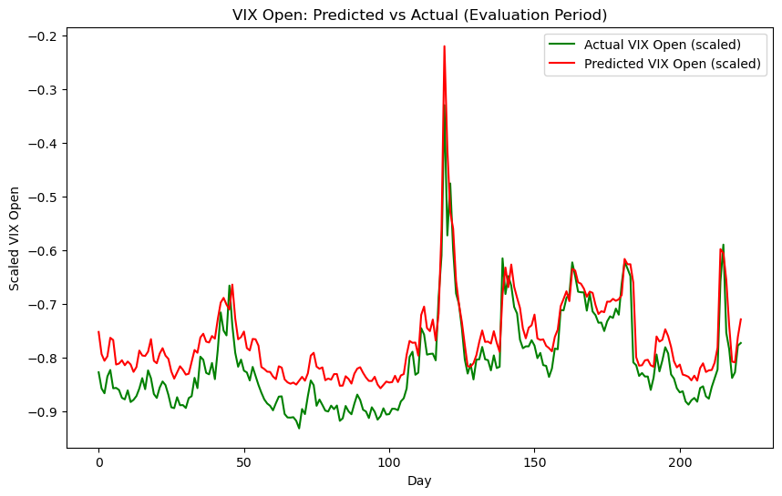

# VIX Forecasting with LSTM

A multi-feature LSTM that predicts the **next-day open of the VIX** volatility index from past VIX and S&P 500 price data. Designed as a **decision-support tool** for discretionary trading: the model outputs a quantitative prediction of where VIX will open tomorrow, giving both a direction and an approximate magnitude that supplements other inputs when forming a view on the next day's move.

Evaluated via directional accuracy on a held-out 12-month evaluation period, the model achieves **73% directional accuracy** (4-run mean) — 23 percentage points above a random baseline and 25 above the standard persistence baseline.

## What this is

The VIX is the CBOE Volatility Index, a measure of expected 30-day volatility in the S&P 500. It is widely tracked as a "fear gauge" for US markets, and a credible view on its direction is useful when sizing positions in VIX-linked derivatives, hedging an equity book, or timing protective trades.

This project asks: **can a recurrent neural network produce useful next-day VIX predictions from public price data alone?**

The model is intentionally simple, and it is intentionally **not** an automated trading strategy. There is no execution layer, no position sizing logic, no risk management built in. The output is a numeric prediction of the next day's VIX Open that a discretionary trader can read alongside their other inputs (market structure, recent flows, term-structure dynamics, qualitative news) when deciding whether to lean long, short, or flat. The objective is to provide a credible model-based prediction as one input to a human decision, with the methodological safeguards (no data leakage, separate evaluation period, baseline comparisons) that distinguish a real result from an overfitted one.

## Approach

**Data**
- 10 years of training data (Jan 2014 – Jan 2024) pulled live from Yahoo Finance via `yfinance`
- 1 year of separate evaluation data (Jan 2024 – Jan 2025) — entirely unseen during training
- 8 features per day: VIX (Open, High, Low, Close) + S&P 500 (Open, High, Low, Close)

**Architecture**
- Stacked LSTM: 128 units → 64 units, with 0.15 dropout between them
- Dense head: 32 → 16 → 1 (single output for next-day VIX Open)
- ~121k trainable parameters
- Adam optimiser, MSE loss, EarlyStopping on validation loss

**Sequence setup**
- Input window: 30 trading days (~6 weeks) of past data
- Target: VIX Open on the next day
- Sliding window over the full series produces ~2,000 training samples

**Methodology safeguards**
- Train/test split happens **before** scaling — the MinMaxScaler is fitted only on the training partition to prevent data leakage from the evaluation period into training
- `shuffle=False` on the split to preserve chronological order
- EarlyStopping watches validation loss to prevent over-training

## Results

| Model | Directional accuracy | Notes |
|---|---|---|
| **LSTM (this notebook)** | **73.2% mean (70.6–75.6%)** | Average of 4 independent training runs |
| Persistence direction (baseline) | 48.6% | "Tomorrow's direction = today's direction" |
| Random (theoretical) | 50.0% | Floor for any directional classifier |

The LSTM achieves **~23 percentage points above random** and **~25 percentage points above the persistence baseline**. Notably, persistence itself scores **below** random (48.6%), reflecting that VIX is mean-reverting at the day level — "tomorrow's direction = today's direction" performs slightly worse than chance because high-vol days tend to be followed by reversion. The LSTM's edge over persistence is therefore not just "captures momentum" but "captures something more useful than momentum."

The 73% result sits at the upper end of the range typically reported in academic VIX prediction literature, where competent ML models score in the 60–65% range and tuned production models reach 70%+.



The model captured the major VIX spike in early August 2024 (the carry-trade unwind event) cleanly in both magnitude and timing. Day-over-day changes track actual moves closely across most of the evaluation period, which is what drives the ~73% directional accuracy. There is a persistent upward level bias during sustained low-volatility periods (visible in the Q1 2024 portion of the evaluation), discussed in the Limitations section. The practical implication is that the predictions are most reliable for **direction and approximate magnitude of moves**, less so for the precise level — a forecast of "VIX up tomorrow, probably by a small amount" is well-supported; a forecast of "VIX will open at exactly 14.2" should not be relied on without contextual judgment.

## How to reproduce

```bash
git clone https://github.com/kaleemkhanbains/vix-forecasting.git
cd vix-forecasting
pip install -r requirements.txt
jupyter notebook vix_forecasting.ipynb
```

Then run all cells in order from the top. The notebook downloads market data automatically via `yfinance`, so no manual data preparation is needed. Training takes approximately 5–10 minutes on a modern laptop CPU.

Alternatively, the first cell of the notebook contains an inline `!pip install` that can be run from within Jupyter or VS Code for one-click setup.

## Tech stack

- Python 3.11
- TensorFlow / Keras (LSTM)
- pandas / NumPy (data handling)
- scikit-learn (preprocessing, train/test split)
- yfinance (live market data)
- matplotlib (visualisation)

## Limitations

The model is a prediction tool, not a complete trading system. The following limitations should shape how the output is used:

- **Single evaluation period.** The 2024 evaluation window included the August carry-trade unwind. Different years may give different results. A rolling-origin evaluation across multiple years would strengthen the conclusion.
- **Three training seeds is the minimum.** A robust evaluation would average results over 10+ random seeds to give tighter confidence intervals.
- **Anchor bias in quiet regimes.** During sustained low-volatility periods, predictions sit higher than actuals because the model learned a mean-reversion bias from the training distribution. The directional component of the prediction remains useful, but the precise level should be treated as approximate rather than authoritative — particularly during sustained calm periods. Predicting returns rather than levels would mitigate this.
- **Level-based loss.** Training on MSE optimises for value prediction, not direction. A classification head trained on directional cross-entropy may produce sharper directional decisions.
- **No additional ML baselines.** A linear regression or gradient boosting model on the same features would isolate how much of the result is LSTM-specific vs "any reasonable ML model can learn this." Adding these would strengthen the claim that the LSTM architecture earns its complexity.
- **No execution or position-sizing modelling.** The model produces a prediction only; translating that into a trade requires the user to apply their own judgment on bid-ask, slippage, position sizing, and risk management.

## What I would do next

If extending this project, some areas to focus on:

1. **Three-way data split.** A formal next step would be a train / validation / test split, with hyperparameter selection done only on the validation period and the evaluation year touched exactly once at the end. The current pipeline uses two splits, which is standard practice for many ML projects but introduces a small upward bias on the reported number.
2. **Add linear regression and gradient boosting baselines** — to isolate the LSTM contribution from "any ML model works."
3. **Replace MSE loss with a classification objective** trained on next-day direction directly.
4. **Multi-period evaluation** — train on rolling 10-year windows and evaluate on the year that follows each, then average results across multiple held-out years for tighter confidence intervals.
5. **Richer features** —  Add technical indicators (RSI, MACD), VIX term structure (futures curve slope).


## Project structure

```
vix-forecasting/
├── README.md                       # this file
├── requirements.txt                # Python dependencies
├── .gitignore                      # files git should ignore
├── vix_forecasting.ipynb           # main notebook (run top to bottom)
└── results/                        # saved plot outputs
    ├── eval_predictions.png
    ├── eval_predictions_zoomed.png
    ├── day_over_day_change.png
    └── loss_curves.png
```

## Acknowledgements

VIX data sourced from CBOE via Yahoo Finance. S&P 500 data sourced from Yahoo Finance. All data accessed programmatically via the `yfinance` Python package; no manual data preparation required.
